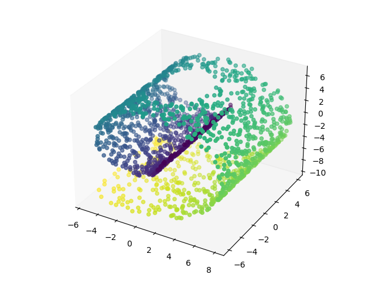
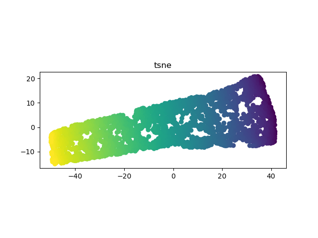
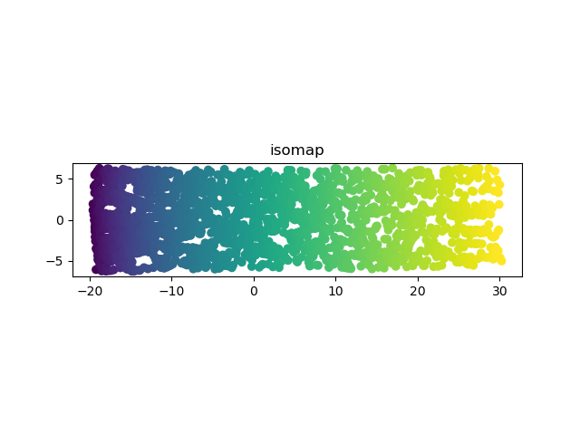
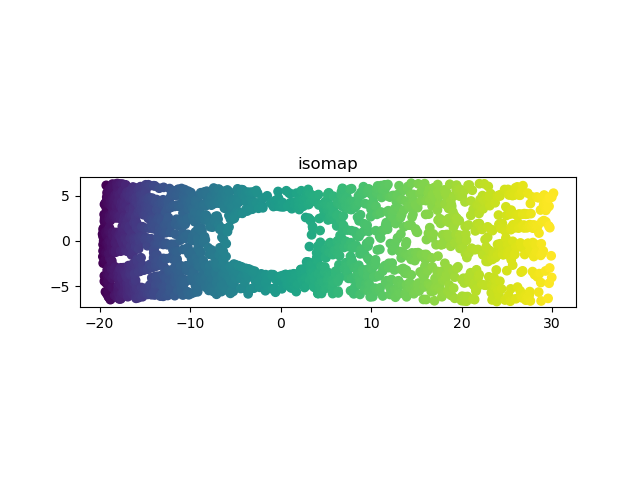

% Manifold Sculpting: an overview
% Gabriele Codega
% January 2023

# Idea
Rearrange points in such a way to **preserve local relationships**

{#id .data-autoplay .class width=50% height=50%}

# Algorithm
```pseudocode
1. Find k-Nearest Neighbours
2. Compute relationships
3. Preprocess with PCA
4. Until convergence
    4a. Scale down dimensions to discard
    4b. Scale up and shift dimensions to keep
5. Embed by discarding unwanted dimensions
```

## Relationships
::::::::::{.columns align=center}
:::{.column width=40% align=center}
- Distance $\delta_{ij}$
- Angle to most colinear neighbour $\theta_{ij}$ 
:::
:::{.column width=60%}

:::
:::::::::

## Optimisation
Adjust points in order to minimise

$e_i = \sum_j w_{ij} \bigg(\bigg(\frac{\delta_{ij}-\delta_{ij0}}{\delta_{ave}} \bigg)^2 + \bigg(\frac{\theta_{ij}-\theta_{ij0}}{\pi} \bigg)^2 \bigg)$

# Parameters

- Number of neighbours $k$
- Scale factor $\sigma$
- Learning rate
- Stopping criterion


# Results
::::::::{.columns}
:::{.column width=50%}

:::
:::{.column width=50%}

:::
::::::::

## Comparison: roll
::::::::{.columns}
:::{.column width=50%}
{#id .class width=400 height=230px}
{#id .class width=400 height=230px}
:::
:::{.column width=50%}
{#id .class width=400 height=230px}
{#id .class width=400 height=230px}
:::
::::::::

## Comparison: hole
::::::::{.columns}
:::{.column width=50%}
{#id .class width=400 height=230px}
{#id .class width=400 height=230px}
:::
:::{.column width=50%}
{#id .class width=400 height=230px}
{#id .class width=400 height=230px}
:::
::::::::

# Comments
::::: columns
::: column
**Pros**

- Accurate
- Can improve other embeddings
:::
::: column
**Cons**

- Hard to tune
- Possibly very slow
- Possible convergence to local minima
:::
:::::